<p align="center">
  <picture>
    <source media="(prefers-color-scheme: dark)" srcset="docs/assets/banner-dark.png">
    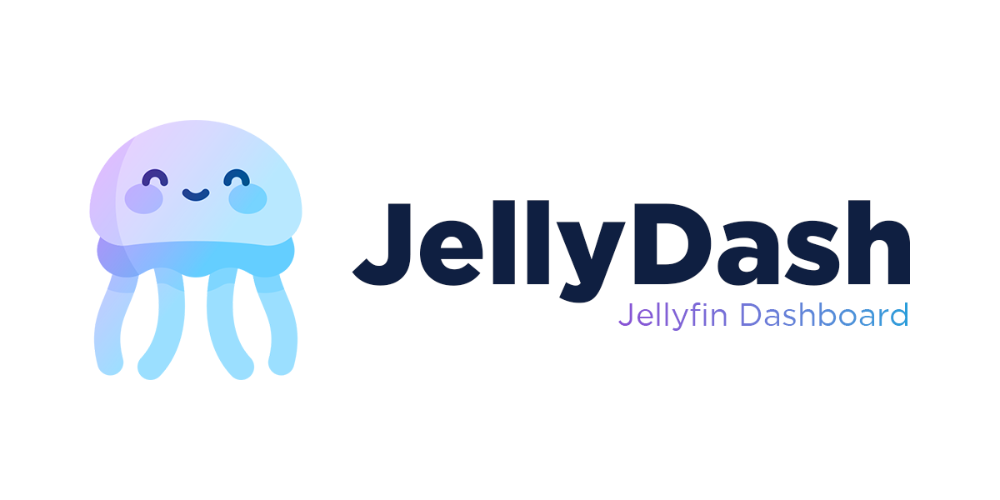
  </picture>
</p>

<p align="center">
  A self-hosted dashboard for your Jellyfin server. See who's watching, keep a play history, follow downloads, explore viewing statistics and get notifications on your phone.
</p>

<p align="center">
  <a href="https://jellydash.madebymartz.com">jellydash.madebymartz.com</a>
</p>

---

## What is Jellydash?

Jellydash is a monitoring dashboard for [Jellyfin](https://jellyfin.org). If you know Tautulli from the Plex world, this is that idea, built for Jellyfin. It runs in Docker alongside your server and helps you check:

- Who is watching right now, and is it transcoding?
- What did people watch this week?
- Which shows and movies are the most popular on my server?
- Did someone just request something new in Jellyseerr?
- What is downloading, and did the latest downloads finish?

It's supposed to be lightweight, without too much bloat and (hopefully) nice looking!

You can install Jellydash on your phone as a PWA and get alerts when someone starts watching. Alerts can go through Telegram, Pushover, Discord, ntfy, Gotify or Web Push, whatever you already use.
I may work on an open-source Android app in the future.

The project is still young and under active development.

## Screenshots

| Now Playing, actively streaming | Now Playing, all quiet |
| --- | --- |
| 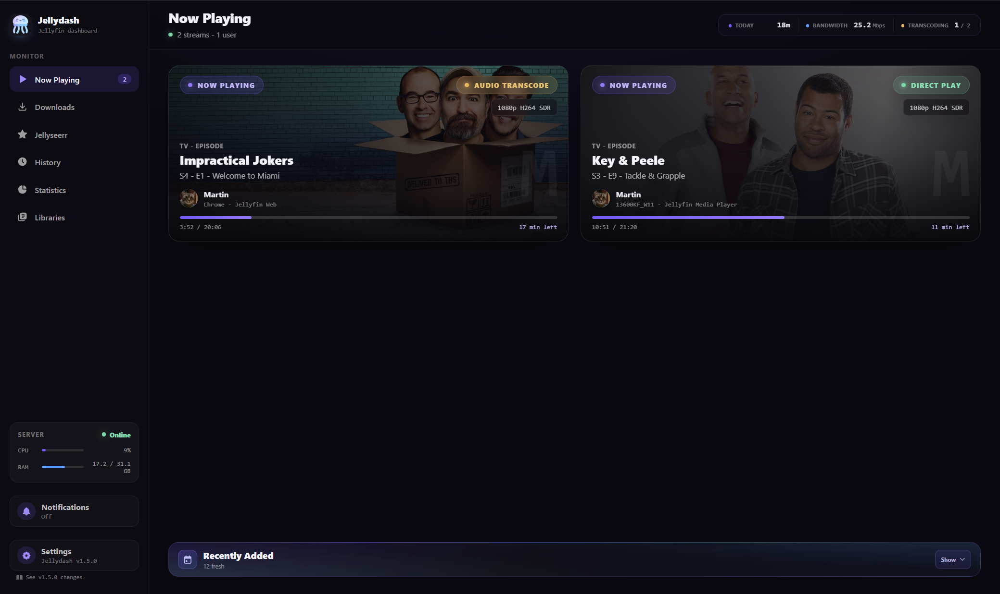 | 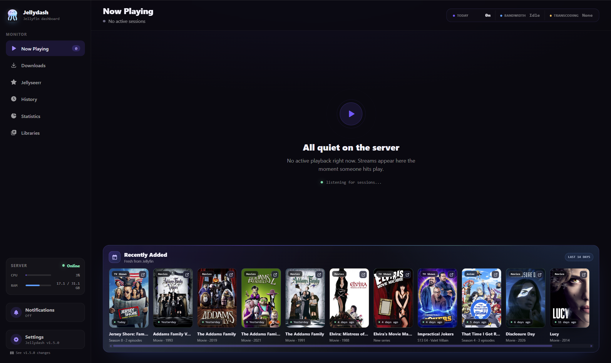 |

| History | Jellyseerr requests |
| --- | --- |
| 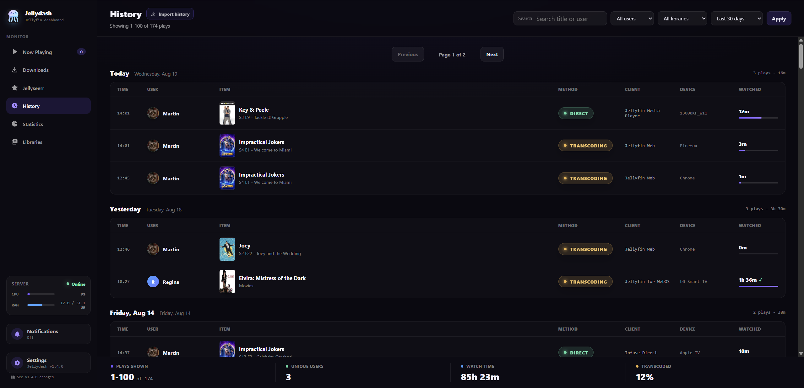 | 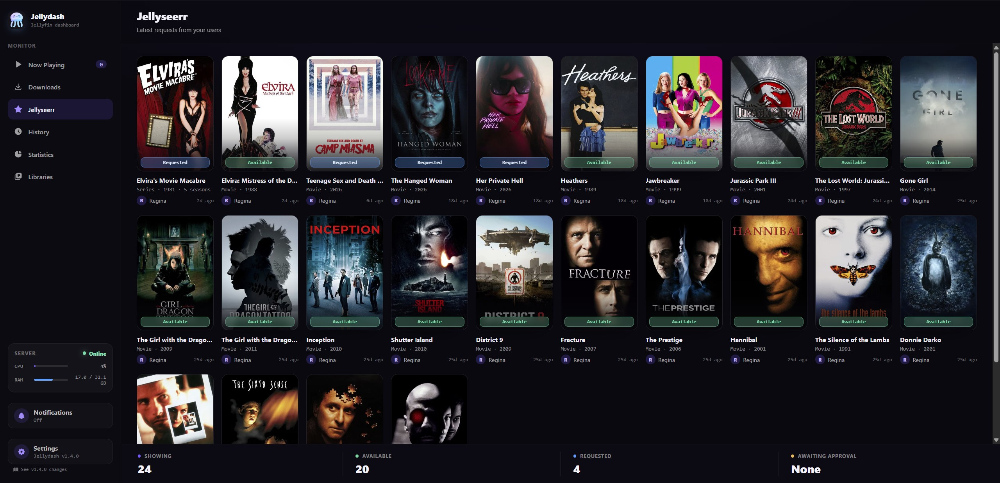 |

| Trending and Most Watched | Statistics |
| --- | --- |
| 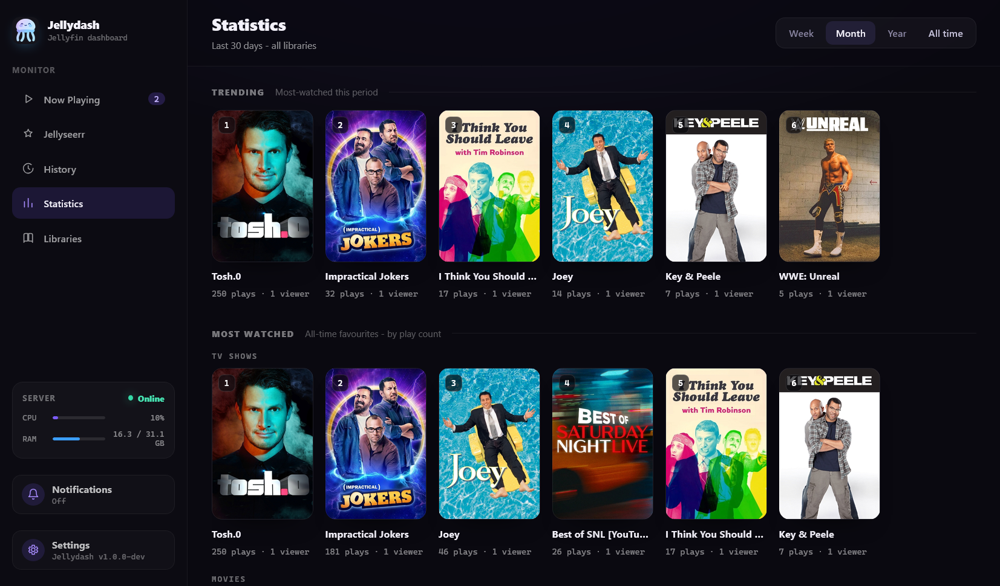 | 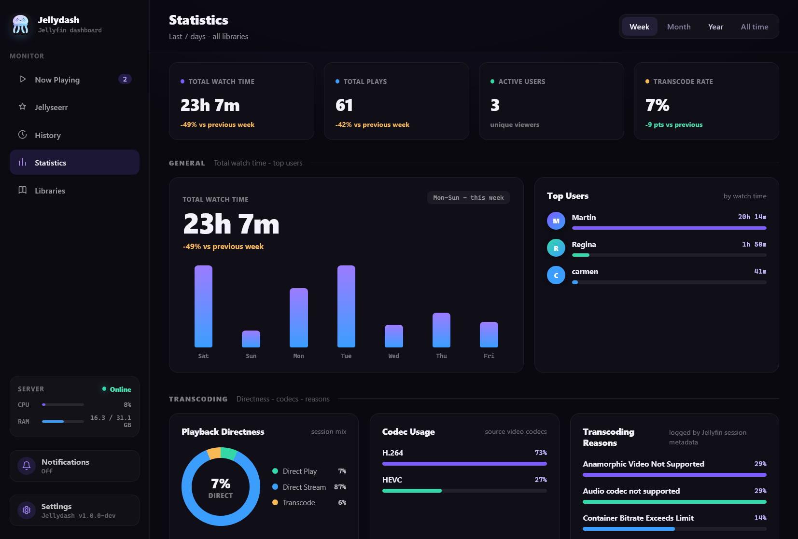 |

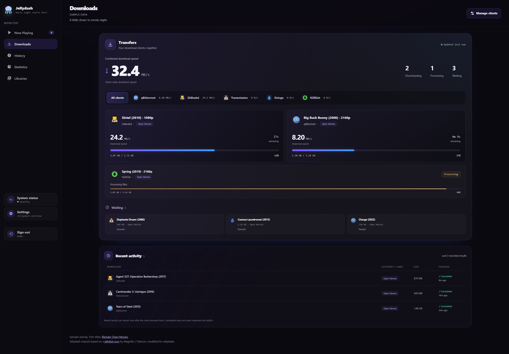

*Downloads with sample activity using Blender Open Movie titles.*

<p align="center">
  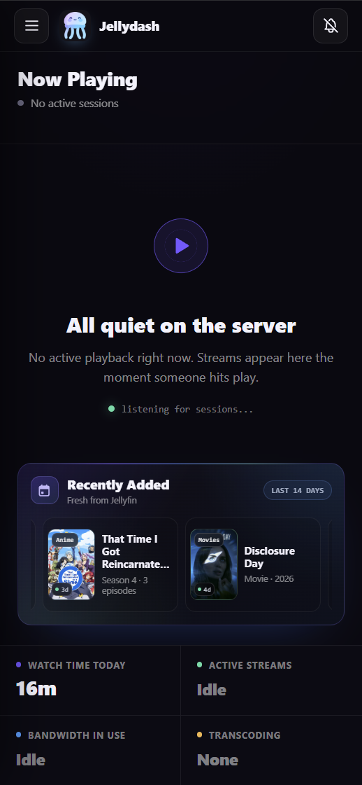
  &nbsp;&nbsp;
  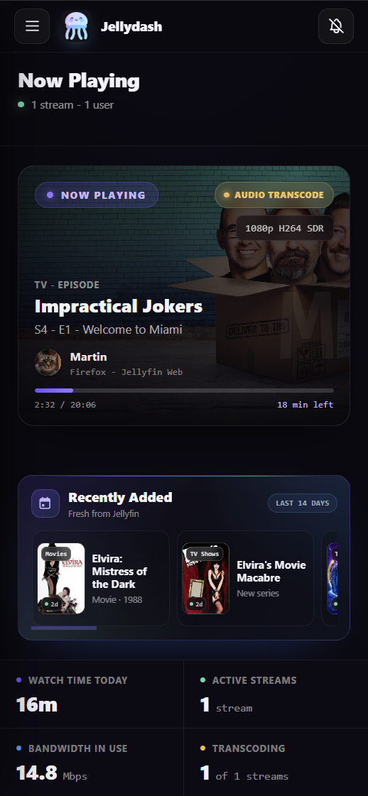
</p>
<p align="center">
  <sub>Installed as an app on Android, actively streaming or all quiet</sub>
</p>

<details>
<summary>More screenshots</summary>

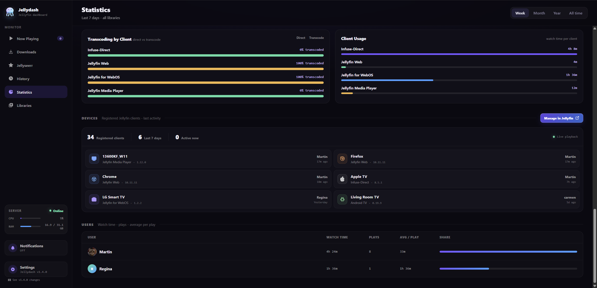

</details>

## Features

- **Now Playing.** Live cards for every active stream: artwork, user, quality, progress and the playback method (Direct Play, Remux or Transcode, including the reason why). Live TV channels from tuners like Tunarr show up too, with real program progress and a red on-air badge.

- **History.** Jellydash records play history in the background, even when nobody has the dashboard open. Search it, filter by user or library, export the matching plays to CSV, and enjoy the poster art. Existing Jellyfin or Emby Playback Reporting backups can be imported from Settings.

- **Statistics.** Watch time trends, top users, device activity, clients, codecs and transcode reasons. There is a Trending strip for what is hot right now, and all-time Most Watched charts for both shows and movies.

- **Monthly recap.** Open Monthly recap from Statistics to look back at a completed month, with watch time, movie and series rankings, daily activity and a viewer filter. Viewing time inferred from older history is labelled as an estimate.

- **Libraries.** An overview of all your libraries with item counts and type breakdowns. New libraries are picked up automatically.

- **System status.** Check background collection, library refreshes, optional request sync, and notification retries from Settings. Copy a diagnostic summary without service URLs, credentials, or viewing details. See [System status](docs/SYSTEM_STATUS.md) for what the checks mean.

- **Monitoring exclusions.** Hide selected Jellyfin users from Now Playing, History, Statistics, and history exports, and stop collecting new activity for them. Existing rows are kept. See [Monitoring exclusions](docs/MONITORING_EXCLUSIONS.md) before enabling this setting.

- **Jellyseerr requests** (optional). The latest requests with their current status, plus a push notification when a new request comes in. The page only appears once you connect your Jellyseerr instance.

- **Downloads** (optional). Follow SABnzbd, qBittorrent, Transmission, Deluge and NZBGet clients on one page. See current jobs and up to 20 recent matching results. Jellydash only reads their status; queue changes still happen in the downloader. See [Downloads setup](docs/DOWNLOADS.md).

- **Notifications** (optional). "Anna started watching The Office" straight to your phone or desktop, even with the app closed. Delivered through Telegram, Pushover, a Discord webhook, ntfy, Gotify, Web Push, or any combination of them.

- **Optional login.** Login is off by default for use on a trusted home network. Enable it with `AUTH_ENABLED=true` and set an initial admin username and password as described in [Optional login](#optional-login). Enable login if you expose Jellydash to the internet. For remote access, I recommend Tailscale.

- **Modules.** Jellydash can load drop-in modules that add whole new pages to the dashboard. See [docs/MODULES.md](docs/MODULES.md) if you want to build your own.

## Quick start

Use Docker Compose with MariaDB or SQLite, or install from Community Apps on Unraid. Choose your setup below.

### MariaDB (default)

The normal setup runs Jellydash and MariaDB together. Choose this if you want the default setup or already use MariaDB.

```bash
mkdir jellydash && cd jellydash
curl -LO https://raw.githubusercontent.com/themartz90/jellydash/main/docker-compose.yml
curl -L -o .env https://raw.githubusercontent.com/themartz90/jellydash/main/.env.example
# edit .env, at minimum: JELLYFIN_URL, JELLYFIN_API_TOKEN, DB_PASS
docker compose up -d
```

### SQLite (optional, lighter setup)

The lighter setup runs only Jellydash and keeps its database in `./sqlite-data/jellydash.sqlite`. Choose this for a small install where you do not want a separate database container.

```bash
mkdir jellydash && cd jellydash
curl -L -o docker-compose.yml https://raw.githubusercontent.com/themartz90/jellydash/main/docker-compose.sqlite.yml
curl -L -o .env https://raw.githubusercontent.com/themartz90/jellydash/main/.env.example
# edit .env, at minimum: JELLYFIN_URL and JELLYFIN_API_TOKEN
docker compose up -d
```

Open `http://your-host:8080`. Both setups create the database tables automatically; you don't need to import an SQL file.

Set `APP_TIMEZONE` in `.env` to your local IANA timezone so History and Statistics use the right date boundaries. Custom `docker run` setups may pass the standard `TZ` variable instead. `APP_TIMEZONE` takes priority when both are present.

Whichever database you choose, the active setup is saved as `docker-compose.yml`. Normal commands, aliases and update scripts work the same way for both.

If you want to use your own MariaDB server or mount modules, copy [docker-compose.override.example.yml](docker-compose.override.example.yml) to `docker-compose.override.yml` and adjust it there.

To set up alerts, see [Notifications](#notifications).

### Unraid

Jellydash is [listed in Unraid Community Apps](https://ca.unraid.net/apps/jellydash-1vybjoi0yy69ry). On your Unraid server, open Apps, search for Jellydash, and select Install.

The [Unraid template](unraid/jellydash.xml) uses the SQLite setup for a new, single-container install. See the [Unraid setup notes](unraid/README.md) for the required fields and persistent data paths. If you already run Jellydash through Compose on Unraid, keep that installation; adding the template does not move its data.

### Updating

For both MariaDB and SQLite:

```bash
docker compose pull && docker compose up -d
```

If you installed SQLite using the first v1.2.0 instructions, you may still have a file named `docker-compose.sqlite.yml`. If there is no `docker-compose.yml` beside it, make SQLite the default once:

```bash
cp docker-compose.sqlite.yml docker-compose.yml
```

If `docker-compose.yml` is your old MariaDB setup, preserve it first:

```bash
cp -n docker-compose.yml docker-compose.mariadb.yml
cmp -s docker-compose.yml docker-compose.mariadb.yml && cp docker-compose.sqlite.yml docker-compose.yml && echo "SQLite is now the default Compose setup"
```

These commands only copy the Compose files. They do not change either database. Afterward, the normal update command above manages SQLite.

### Moving from MariaDB to SQLite

You do not need to migrate. Existing MariaDB installations continue working exactly as before. Follow this only if you choose to switch to SQLite.

Stop Jellydash first so no plays or settings change during the copy. The migration checks every copied value and leaves the original MariaDB data untouched.

First preserve your current MariaDB Compose file for rollback. This will not overwrite an existing backup. Continue only when it prints `MariaDB Compose backup verified`:

```bash
cp -n docker-compose.yml docker-compose.mariadb.yml
cmp -s docker-compose.yml docker-compose.mariadb.yml && echo "MariaDB Compose backup verified"
```

Then run:

```bash
curl -LO https://raw.githubusercontent.com/themartz90/jellydash/main/docker-compose.sqlite.yml
docker compose pull app
docker compose stop app
mkdir -p sqlite-data
docker compose run --rm --no-deps -v "$(pwd)/sqlite-data:/export" app php bin/console.php database:migrate-to-sqlite /export/jellydash.sqlite --confirm-stopped
docker compose down
cp docker-compose.sqlite.yml docker-compose.yml
docker compose up -d
```

From then on, the normal `docker compose` commands manage SQLite. Keep the old MariaDB volume until you have checked the SQLite install and made a backup.

To go back to MariaDB:

```bash
docker compose down
cp docker-compose.mariadb.yml docker-compose.yml
docker compose up -d
```

### Building from source

To build the image yourself:

```bash
git clone https://github.com/themartz90/jellydash.git
cd jellydash
cp .env.example .env
# edit .env as above
docker compose -f docker-compose.yml -f docker-compose.build.yml up -d --build
```

Updating then means `git pull` and running the same command again. For a source-built SQLite install, replace `docker-compose.yml` with `docker-compose.sqlite.yml`.

## Downloads

Open the Downloads card in Settings, then select **Manage clients** to add a client, test its connection and choose which categories, tags or labels to monitor. You can add up to ten clients. The Downloads page appears once a client is configured, and Now Playing shows a small activity indicator. With Jellydash login enabled, an owner or admin manages these settings.

**Enable Downloads** is checked by default. Clear it in Settings to hide the page and stop collecting updates. Your saved connections and recorded results stay in Jellydash for when you turn it back on. Disabling one client affects only that client; removing a client also removes its locally stored download history.

The Docker app already runs the Downloads collector. If you run Jellydash locally without Docker, schedule `php bin/console.php downloads:poll` yourself. Keep `/var/www/html/var/data` persistent in Docker: it holds the integration key needed to read saved downloader credentials after a container replacement. See [Downloads setup](docs/DOWNLOADS.md) for client-specific settings, filters, persistence and the monitor's limits.

## Notifications

Jellydash can ping you when someone starts playing and when a new Jellyseerr request comes in. Pick whichever channels you already use.

Jellydash sends each alert through every configured channel. If any channel accepts it, the alert is marked as delivered, and failed channels aren't retried separately. If all channels fail, the alert goes into the retry queue.

Configure Telegram, Pushover, Discord, ntfy and Gotify in `.env`. Each is optional and stays off until its required settings are filled in. Web Push uses `.env` for its server keys and browser permission for each receiving device.

After changing channel settings in `.env`, recreate the app container with `docker compose up -d --force-recreate app`. If you run the separate SQLite file with `-f docker-compose.sqlite.yml`, keep that option in this command too. A plain container restart does not reload Compose environment values.

If you are upgrading an existing MariaDB install, update its Compose file to include the new notification variables, preserving your custom settings and overrides. The current `docker-compose.yml` forwards them to the app; older copies do not. The SQLite Compose setup reads `.env` through `env_file`. Custom Compose setups must also pass the chosen channel's variables to the app container.

Two things that apply to all channels:

- Set `APP_URL=https://your-dashboard.example.com` if you want alerts to link back to your dashboard.
- You can exclude users from triggering alerts (usually yourself) in the Settings page inside the app.

Run this to test your setup. It reports each channel separately:

```bash
docker compose exec app php bin/console.php push:test
```

### Telegram

1. Message [@BotFather](https://t.me/BotFather), send `/newbot` and answer its two questions. It gives you a bot token.
2. Open a chat with your new bot and send it any message (bots cannot message you first).
3. Visit `https://api.telegram.org/bot<YOUR_TOKEN>/getUpdates` in a browser and find `"chat":{"id":...}` in the response. That number is your chat ID.

```bash
TELEGRAM_BOT_TOKEN=123456789:your-token
TELEGRAM_CHAT_ID=your-chat-id
```

### Pushover

Your User Key is on the [pushover.net](https://pushover.net) dashboard. Then create an application there (call it Jellydash) to get an API token.

```bash
PUSHOVER_APP_TOKEN=your-app-token
PUSHOVER_USER_KEY=your-user-key
```

### Discord

Open **Server Settings > Integrations > Webhooks > New Webhook**, choose a channel and copy the webhook URL. No bot needed.

```bash
DISCORD_WEBHOOK_URL=https://discord.com/api/webhooks/...
```

### ntfy

Use your own [ntfy server](https://docs.ntfy.sh/) or `https://ntfy.sh`. Subscribe to the same server and topic in your ntfy client.

```bash
NTFY_URL=https://ntfy.example.com
NTFY_TOPIC=jellydash
NTFY_TOKEN=your-access-token
```

`NTFY_URL` is the server base URL, without the topic. `NTFY_TOPIC` accepts 1-64 letters, digits, underscores or hyphens; ntfy's reserved route names are not valid topics. An access token needs permission to publish to that topic. Leave `NTFY_TOKEN` empty only if the server allows anonymous publishing. Username/password authentication is not supported by this channel.

Use an access-controlled topic for viewing activity. A publishing token alone does not make a topic private: its read permissions must also restrict who can subscribe. Jellydash does not choose a server or topic for you.

### Gotify

Create an application in your [Gotify server](https://gotify.net/docs/) and copy its application token. Subscribe through the Gotify web interface or a compatible client.

```bash
GOTIFY_URL=https://gotify.example.com
GOTIFY_APP_TOKEN=your-application-token
```

`GOTIFY_URL` is the server base URL, without `/message`. Use an application token, not a client token. Alerts use priority 5 and plain text. Notification links open the dashboard on clients that support Gotify's click action.

Both channels support custom ports and base-path prefixes. Use the final service URL: Jellydash does not follow redirects. HTTPS certificates must be valid and trusted by the app container. Explicit HTTP URLs are allowed for trusted private networks, but messages and tokens then travel unencrypted.

For these two channels, Jellydash limits titles to 1,024 UTF-8 bytes and message text to 4,096 bytes, adding an ellipsis if shortened. This keeps ordinary alerts within ntfy's default text limits. A server can enforce lower limits or rate limits; failures appear in `var/log/app.log` without the token or message content. The test command reports server acceptance, so also check that the notification reaches your client.

### Web Push (browser and the installed app)

Web Push sends notifications to your browser or installed PWA through your browser's push service. Your dashboard must use HTTPS. Generate a keypair once:

```bash
docker compose exec app php bin/console.php push:vapid
```

Paste the two keys into `.env` and recreate the app container as described above. Then tap the bell in the app, allow notifications and check that the test notification arrives. Jellydash accepts browser subscriptions from the push services used by Firefox, Chromium browsers, Safari and Edge. Other endpoint hosts are rejected.

Web Push only supports the browser push services listed above. Jellydash verifies HTTPS certificates and does not follow redirects, but it does not pin DNS answers. Custom push endpoint hosts are not supported.

One installation stores up to 100 browser notification devices by default, with up to 10 per signed-in account. Set `PUSH_MAX_SUBSCRIPTIONS` or `PUSH_MAX_SUBSCRIPTIONS_PER_ACCOUNT` if you need different limits. Existing devices can refresh their subscription when a limit is full.

## Optional login

Set this in `.env`:

```bash
AUTH_ENABLED=true
AUTH_ADMIN_USER=admin
AUTH_ADMIN_PASSWORD=pick-a-strong-one
```

The password needs at least 8 characters. The admin user is created automatically on the next start. More users can be added with `docker compose exec app php bin/console.php user:add`.

Owners and administrators manage global Settings, imports, History repair and server-wide notification tests. Regular users can read the dashboard and manage their own browser notification devices. Guests have read-only access.

Notification devices registered before account ownership was added stay paused while login is enabled until the same browser enrolls again. They continue working when login is disabled.

If an installation has no owner or administrator, use `docker compose exec app php bin/console.php user:role <username> 1` to promote an existing account explicitly, or add a new owner with `user:add` and role `1`. Use `push:devices` to review safe device metadata and `push:revoke <device-id>` to remove a legacy device. These commands do not print push endpoints or keys.

On the login page, **Keep me signed in** lets that browser restore your login for up to 90 days. The remembered login is renewed when you return and removed when you sign out or change your password.

Both supplied Compose setups keep ordinary sessions in a named volume, so later container recreations do not sign you out early. When you first adopt an updated Compose file, the new volume starts empty and you may need to sign in once. Sessions still expire after one hour idle or eight hours since login.

## Exclusions in Settings or the environment

Open **Settings > Exclusions** to manage these options:

| Option | What it excludes | Environment fallback |
| --- | --- | --- |
| Monitoring | Selected users from Now Playing, History, Statistics, library playback summaries and CSV exports. New plays and history imports for those users are skipped. | `IGNORE_USERS` |
| Notifications | Playback alerts for selected users. Their activity is still recorded unless they are also excluded from monitoring. | `PUSH_IGNORE_USERS` |
| Statistics | Selected libraries from Trending, Most Watched and Monthly recap title rankings. Viewing totals and History remain visible. | `TRENDING_EXCLUDE_LIBRARIES` |

Environment values are comma-separated names, for example `IGNORE_USERS=Admin,Test`. Saved Settings values take priority over the environment, including an empty selection. To change a saved exclusion, use Settings. For Docker environment changes, recreate the app container so it receives the new values.

Monitoring exclusions preserve existing database rows. Removing an exclusion makes that earlier activity visible again; Jellydash cannot reconstruct activity it skipped while the user was excluded. Username matching is exact and case-insensitive. If you rename an account, update its exclusion. See [Monitoring exclusions](docs/MONITORING_EXCLUSIONS.md) for details.

Confirmed background theme songs and videos are excluded automatically. The history poller also checks older items and hides confirmed theme plays from History, Statistics and CSV exports while preserving the stored rows. Ordinary music stays monitored. See [Background theme media](docs/MONITORING_EXCLUSIONS.md#background-theme-media) for detection rules and limits.

## Exporting History

Use **Export CSV** on the History page to choose a search, user, library and time period before downloading. Jellydash shows the exact number of matching plays, and the export is never limited to the page you are viewing. You can import the exported file back into Jellydash. See [History CSV format](docs/HISTORY_CSV.md) for format versions and compatibility details.

To restore that file, open **Settings → Import play history** and choose **Jellydash CSV**. Jellydash previews new and already-present plays before asking you to confirm. Imports are transactional, skip duplicates and never trigger playback notifications.

## Importing Playback Reporting history

Jellydash only records plays from the moment it starts. If you already used Playback Reporting on [Jellyfin](https://github.com/jellyfin/jellyfin-plugin-playbackreporting) or [Emby](https://github.com/faush01/playback_reporting), you can import that history.

The plugin backup is a TSV file with no header row. You can also provide `playback_reporting.db`, or import directly while the plugin API is available.

Use **Import history** on the History page, or open the importer directly from Settings. Drop a TSV backup or `playback_reporting.db` (20 MB max) there. The file type is detected automatically. Jellydash counts the plays first, then asks you to confirm before writing anything. If the plugin is still installed, **Import from server plugin** appears too.

Jellydash looks up user names through the connected server's `/Users` API and media runtime through `/Items` (`RunTimeTicks`). As with live history, a play is marked finished at 95% of the item's runtime. If the item no longer exists, runtime stays empty and the play is left unfinished.

`PlayDuration` is elapsed session time, not playback position. When an Emby backup includes `PauseDuration`, Jellydash subtracts that paused time from the watched total. Dates stay in the server's local time, as recorded by the plugin.

Each play is assigned to the item's current library using its file path. If the item is gone, Jellydash falls back to its media type, such as Movies for a Movie or TV Shows for an Episode.

Imported plays never trigger notifications. Re-importing skips duplicates, but can fill in missing runtime and replace a generic library label if the server is reachable the second time.

If you have ignored users configured, the import stops before writing a play whose user name cannot be resolved. Check the server connection and retry. With no ignored users, offline imports can still keep unnamed plays.

This compatibility only covers Playback Reporting imports from Emby. Jellydash is built and tested for Jellyfin; full Emby server support is not available.

## Good to know

- The CPU and RAM numbers in the sidebar come from the host the container runs on.
- iOS only supports Web Push for apps installed to the home screen, and only on iOS 16.4 or newer. That is an Apple rule, not mine 👀. Telegram and Pushover are other options for iPhone notifications.
- Brave blocks Web Push by default. It works after enabling "Use Google services for push messaging" in Brave's privacy settings.
- Edge hides Web Push permission prompts behind a small bell icon in the address bar ("quiet notification requests"). If enabling notifications keeps snapping back to off, allow notifications for the site there, and check that Windows itself allows notifications from Edge.
- Trending and Most Watched can exclude libraries you pick (Settings page). Useful for libraries full of temporary stuff.
- Monitoring exclusions match complete Jellyfin usernames without caring about letter case. They do not change notification exclusions.

## Support Jellydash

Jellydash is free and always will be. If you enjoy it and want to support its development, you can buy me a coffee.

[](https://www.buymeacoffee.com/themartz90)

## Credits

The Jellydash mascot is based on a [jellyfish icon](https://www.flaticon.com/free-icon/jellyfish_2977310) by Magnific from [Flaticon](https://www.flaticon.com), modified for this project.

Interface icons come from [Tabler Icons](https://tabler.io/icons), used under its [MIT license](THIRD_PARTY_NOTICES.md).

## License

The code is licensed under [MIT](LICENSE). The original mascot icon is covered by the Flaticon license above, not MIT. Third-party license notices are collected in [THIRD_PARTY_NOTICES.md](THIRD_PARTY_NOTICES.md).
